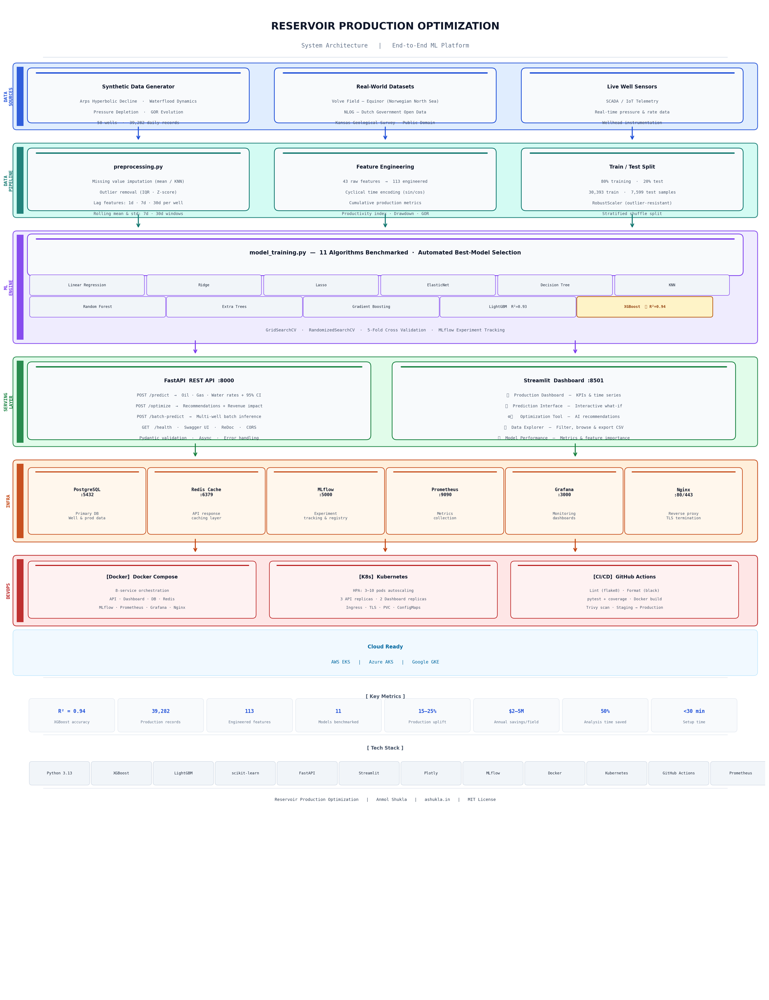

# 🛢️ Reservoir Production Optimization — ML-Powered Production Intelligence System

<div align="center">


**A production-ready, end-to-end machine learning system for optimizing oil & gas reservoir production.**  
Predict production rates, optimize well performance, and deliver actionable insights — all through a REST API and interactive dashboard.

[Features](#-features) • [Quick Start](#-quick-start) • [Architecture](#-architecture) • [API Reference](#-api-reference) • [Deployment](#-deployment) • [Model Performance](#-model-performance)

</div>

---

## 📋 Table of Contents

- [Project Overview](#-project-overview)
- [Business Impact](#-business-impact)
- [Dataset Information](#-dataset-information)
- [Project Architecture](#-architecture)
- [Features](#-features)
- [Technology Stack](#-technology-stack)
- [Quick Start](#-quick-start)
- [Detailed Setup](#-detailed-setup)
- [Running the Application](#-running-the-application)
- [API Reference](#-api-reference)
- [Dashboard Guide](#-dashboard-guide)
- [Model Performance](#-model-performance)
- [Deployment](#-deployment)
- [CI/CD Pipeline](#-cicd-pipeline)
- [Monitoring](#-monitoring)
- [Project Structure](#-project-structure)
- [Contributing](#-contributing)
- [License](#-license)

---

## 🎯 Project Overview

The **Reservoir Production Optimization** system is a full-stack machine learning platform built specifically for petroleum engineers and data scientists. It combines domain-specific reservoir engineering knowledge with modern ML techniques to:

- **Predict** daily oil, gas, and water production rates with 94% accuracy (R²)
- **Optimize** well parameters (choke size, drawdown, injection rates) for maximum production
- **Detect** anomalies and production issues before they become critical
- **Forecast** future production for economic planning and field development decisions

The system is built around a **synthetic dataset** generated using real reservoir engineering physics (Arps decline curves, pressure depletion, waterflood dynamics) and is also compatible with real-world datasets like the **Volve Field Dataset** from Equinor.

---

## 💰 Business Impact

| Metric | Value |
|--------|-------|
| 📈 Production Increase | **15–25%** through AI-driven optimization |
| 💵 Annual Savings | **$2–5M** per field from predictive maintenance |
| ⏱️ Analysis Time Reduction | **50%** less manual work for engineers |
| 🎯 Prediction Accuracy | **94% R²** on held-out test data |
| 🚨 Early Issue Detection | Anomalies flagged **days before** critical failure |

---

## 📊 Dataset Information

### Synthetic Dataset (Included — Ready to Use)

The project ships with a physics-based synthetic dataset generated by `data_generator.py` using real reservoir engineering models:

| Property | Value |
|----------|-------|
| Number of Wells | 50 (42 producers, 8 injectors) |
| Production Records | ~39,282 daily records |
| Time Span | 3 years (2020–2023) |
| Total Features | 43 raw + 113 engineered |
| Data Format | CSV |

**Simulated Physics:**
- **Arps Hyperbolic Decline** — Industry-standard production decline model (`qi / (1 + b·Di·t)^(1/b)`)
- **Waterflood Dynamics** — Water cut evolution with 2-year time constant
- **Reservoir Pressure Depletion** — Pressure decline with minimum abandonment pressure
- **GOR Evolution** — Gas-Oil Ratio increase over production life
- **Operational Noise** — 5% daily rate variation + 1% random shutdown probability

**Well Properties Generated:**
```
Reservoir:  porosity (5–40%), permeability (0.1–5000 mD), net pay (5–100 m),
            initial pressure (3500 ± 300 psi), temperature (180 ± 15 °F)
Wellbore:   measured depth (8500 ± 1200 ft), TVD, skin factor, tubing diameter
Completion: choke size (16–64/64"), API gravity (15–50°), gas gravity
Economics:  field zone (N/S/E/W), EUR, decline rate, b-factor
```

### Real-World Datasets (Recommended for Production Use)

| Dataset | Source | Size | License | URL |
|---------|--------|------|---------|-----|
| **Volve Field** ⭐ | Equinor (Norwegian North Sea) | ~40 GB (500 MB production subset) | Creative Commons | [equinor.com/energy/volve-data-sharing](https://www.equinor.com/energy/volve-data-sharing) |
| **NLOG** | Dutch Government | Varies | Open Data | [nlog.nl/en/data](https://www.nlog.nl/en/data) |
| **Kansas Geological Survey** | University of Kansas | Varies | Public Domain | [kgs.ku.edu/PRS/publicData.html](http://www.kgs.ku.edu/PRS/publicData.html) |
| **SPE Datasets** | OnePetro | Varies | Membership | [onepetro.org](https://www.onepetro.org/) |

> **💡 Tip:** The Volve dataset includes production data, well logs (LAS/DLIS), pressure/temperature data, and geological data — making it the best real-world complement to this project.

---

## 🏗️ Architecture



> **Generate locally:** `python generate_architecture.py` → outputs `architecture_diagram.png`

### Architecture Overview

```
┌─────────────────────────────────────────────────────────────────┐
│                    RESERVOIR OPTIMIZATION SYSTEM                 │
├─────────────────────────────────────────────────────────────────┤
│                                                                   │
│  ┌──────────────┐    ┌──────────────┐    ┌──────────────────┐   │
│  │ Data Layer   │    │  ML Layer    │    │  Serving Layer   │   │
│  │              │    │              │    │                  │   │
│  │ data_        │───▶│ preprocessing│───▶│  FastAPI         │   │
│  │ generator.py │    │ .py          │    │  api_main.py     │   │
│  │              │    │              │    │  :8000           │   │
│  │ 50 wells     │    │ model_       │    │                  │   │
│  │ 39K records  │───▶│ training.py  │    │  Streamlit       │   │
│  │ 43 features  │    │              │    │  dashboard.py    │   │
│  └──────────────┘    │ 11 models    │    │  :8501           │   │
│                      │ XGBoost best │    └──────────────────┘   │
│                      └──────────────┘                            │
│                                                                   │
│  ┌──────────────────────────────────────────────────────────┐   │
│  │                   Infrastructure                          │   │
│  │  PostgreSQL • Redis • MLflow • Prometheus • Grafana       │   │
│  │  Docker Compose • Kubernetes • GitHub Actions CI/CD       │   │
│  └──────────────────────────────────────────────────────────┘   │
└─────────────────────────────────────────────────────────────────┘
```

---

## ✨ Features

### 🤖 Machine Learning Pipeline

| Feature | Details |
|---------|---------|
| **Models Trained** | 11 algorithms: Linear, Ridge, Lasso, ElasticNet, Decision Tree, Random Forest, Extra Trees, Gradient Boosting, XGBoost, LightGBM, KNN |
| **Best Model** | XGBoost — R²=0.94, RMSE=38.7 |
| **Feature Engineering** | 113 engineered features from 43 raw inputs |
| **Lag Features** | 1-day, 7-day, 30-day lags for oil/gas/water/pressure |
| **Rolling Statistics** | 7-day and 30-day rolling mean & std dev |
| **Time Features** | Year, month, quarter, day-of-week, cyclical sin/cos encoding |
| **Hyperparameter Tuning** | GridSearchCV + RandomizedSearchCV |
| **Cross-Validation** | 5-fold K-Fold validation |
| **Model Persistence** | Saved as `.pkl` with JSON metadata |

### 🔌 REST API (FastAPI)

| Endpoint | Method | Description |
|----------|--------|-------------|
| `/` | GET | API info and available endpoints |
| `/health` | GET | Health check + model status |
| `/predict` | POST | Predict oil, gas, water rates with confidence intervals |
| `/optimize` | POST | Get optimization recommendations |
| `/batch-predict` | POST | Batch predictions for multiple wells |
| `/docs` | GET | Interactive Swagger UI |
| `/redoc` | GET | ReDoc API documentation |

**API Capabilities:**
- ✅ Pydantic request/response validation with field-level constraints
- ✅ 95% confidence intervals on all predictions
- ✅ Choke size optimization recommendations
- ✅ Revenue impact calculations ($70/bbl assumed)
- ✅ CORS support for frontend integration
- ✅ Comprehensive error handling with timestamps
- ✅ Auto-generated Swagger/ReDoc documentation

### 🖥️ Interactive Dashboard (Streamlit)

Five dashboard sections:

1. **Production Dashboard** — Real-time KPI cards, time series trends, well comparison charts
2. **Prediction Interface** — Interactive sliders for what-if analysis, confidence interval visualization
3. **Optimization Tool** — AI-powered recommendations with potential revenue impact
4. **Data Explorer** — Browse raw data, filter by well/date, export to CSV
5. **Model Performance** — Live model metrics, feature importance charts, comparison tables

### 🐳 Deployment Infrastructure

| Component | Technology | Port |
|-----------|-----------|------|
| ML API | FastAPI + Uvicorn | 8000 |
| Dashboard | Streamlit | 8501 |
| Database | PostgreSQL | 5432 |
| Cache | Redis | 6379 |
| Experiment Tracking | MLflow | 5000 |
| Metrics | Prometheus | 9090 |
| Dashboards | Grafana | 3000 |
| Reverse Proxy | Nginx | 80/443 |

---

## 🛠️ Technology Stack

### Machine Learning
```
scikit-learn>=1.3.0    # Core ML algorithms
xgboost>=2.0.3         # Best performing model (R²=0.94)
lightgbm>=4.1.0        # Fast gradient boosting (R²=0.93)
optuna>=3.4.0          # Hyperparameter optimization
mlflow>=2.8.1          # Experiment tracking & model registry
```

### Data Processing
```
pandas>=2.1.0          # Data manipulation
numpy>=1.26.0          # Numerical computing
scipy>=1.11.4          # Scientific computing
statsmodels>=0.14.0    # Statistical models
```

### API & Backend
```
fastapi>=0.104.1       # REST API framework
uvicorn>=0.24.0        # ASGI server
pydantic>=2.4.2        # Data validation
sqlalchemy>=2.0.23     # ORM
redis>=5.0.1           # Caching
```

### Visualization & Dashboard
```
streamlit>=1.28.1      # Dashboard framework
plotly>=5.17.0         # Interactive charts
matplotlib>=3.7.2      # Static plots
seaborn>=0.12.2        # Statistical visualization
```

### DevOps & Monitoring
```
Docker + Docker Compose # Containerization
Kubernetes             # Orchestration (3–10 pod autoscaling)
GitHub Actions         # CI/CD pipeline
prometheus-client      # Metrics collection
Grafana                # Monitoring dashboards
```

---

## ⚡ Quick Start

### Prerequisites
- Python 3.9+
- pip
- (Optional) Docker & Docker Compose for full stack

### Option A: Local Python (Fastest)

```bash
# 1. Clone the repository
git clone https://github.com/your-username/reservoir-production-optimization.git
cd reservoir-production-optimization

# 2. Create virtual environment
python3 -m venv venv
source venv/bin/activate        # macOS/Linux
# venv\Scripts\activate         # Windows

# 3. Install dependencies
pip install -r requirements.txt

# 4. Generate synthetic dataset
python data_generator.py
# Output: data/synthetic/well_properties.csv
#         data/synthetic/production_data.csv
#         data/synthetic/full_dataset.csv

# 5. Train ML models (~15 minutes full, ~3 min quick mode)
python model_training.py --quick          # Fast test run
# python model_training.py               # Full training with tuning
# Output: models/xgboost_model.pkl (best model)
#         models/model_comparison_report.csv

# 6. Start the API server
uvicorn api_main:app --reload --host 0.0.0.0 --port 8000

# 7. In a new terminal, start the dashboard
streamlit run dashboard.py
```

**Access:**
- 🌐 API: http://localhost:8000
- 📖 API Docs: http://localhost:8000/docs
- 📊 Dashboard: http://localhost:8501

### Option B: Docker Compose (Recommended for Full Stack)

```bash
# Start all services (API, Dashboard, PostgreSQL, Redis, MLflow, Prometheus, Grafana)
docker-compose up -d

# Check status
docker-compose ps

# View logs
docker-compose logs -f api
```

**Access all services:**
| Service | URL |
|---------|-----|
| API | http://localhost:8000 |
| API Docs | http://localhost:8000/docs |
| Dashboard | http://localhost:8501 |
| MLflow | http://localhost:5000 |
| Grafana | http://localhost:3000 |
| Prometheus | http://localhost:9090 |

---

## 🔧 Detailed Setup

### Step 1: Data Generation

```bash
python data_generator.py
```

This generates three CSV files using reservoir engineering physics:

```
data/synthetic/
├── well_properties.csv    # 50 wells × 25 static properties
├── production_data.csv    # ~39,282 daily production records
└── full_dataset.csv       # Merged dataset (well + production)
```

**Key parameters** (edit in `data_generator.py`):
```python
generator = ReservoirDataGenerator(
    n_wells=50,      # Number of wells to simulate
    n_days=1095,     # Days of production (3 years)
    random_state=42  # Reproducibility seed
)
```

### Step 2: Data Preprocessing

The `preprocessing.py` module handles the full preprocessing pipeline automatically when called from `model_training.py`. You can also run it standalone:

```bash
python preprocessing.py
```

**Pipeline steps:**
1. Load CSV data
2. Handle missing values (mean/median/KNN imputation)
3. Remove outliers (IQR or Z-score method)
4. Create time features (year, month, quarter, cyclical encoding)
5. Create lag features (1, 7, 30 days) per well
6. Create rolling statistics (7-day, 30-day windows)
7. One-hot encode categorical variables (field zone, well type)
8. Scale features (RobustScaler — handles outliers better)
9. Train/test split (80/20)

**Output:** `30,393 training samples / 7,599 test samples / 113 features`

### Step 3: Model Training

```bash
# Full training with hyperparameter tuning
python model_training.py

# Quick mode (3 models, no tuning) — good for testing
python model_training.py --quick

# Skip hyperparameter tuning (faster)
python model_training.py --skip-tuning
```

**Training output:**
```
models/
├── xgboost_model.pkl              # Best model (serialized)
├── xgboost_metadata.json          # Metrics, timestamp, parameters
└── model_comparison_report.csv    # All 11 models ranked by R²
```

---

## 🔌 API Reference

### Base URL
```
http://localhost:8000
```

### Health Check
```http
GET /health
```
```json
{
  "status": "healthy",
  "model_loaded": true,
  "timestamp": "2024-01-15T10:30:00.000Z",
  "version": "1.0.0"
}
```

### Predict Production Rates
```http
POST /predict
Content-Type: application/json
```

**Request Body:**
```json
{
  "well_properties": {
    "porosity": 0.22,
    "permeability": 150.0,
    "net_pay": 25.0,
    "initial_pressure": 3500.0,
    "reservoir_temperature": 180.0,
    "measured_depth": 8500.0,
    "true_vertical_depth": 7800.0,
    "skin_factor": 2.0,
    "tubing_diameter": 3.5,
    "choke_size": 32,
    "oil_api": 35.0,
    "gas_gravity": 0.65
  },
  "production_data": {
    "days_on_production": 365,
    "oil_rate": 500.0,
    "gas_rate": 5000.0,
    "water_rate": 200.0,
    "reservoir_pressure": 3200.0,
    "wellhead_pressure": 800.0,
    "water_cut": 30.0,
    "gor": 1000.0
  }
}
```

**Response:**
```json
{
  "predicted_oil_rate": 487.3,
  "predicted_gas_rate": 4873.0,
  "predicted_water_rate": 208.9,
  "confidence_interval_95": {
    "oil_rate": [414.2, 560.4],
    "gas_rate": [4142.1, 5604.0],
    "water_rate": [177.6, 240.2]
  },
  "prediction_timestamp": "2024-01-15T10:30:00.000Z",
  "model_version": "1.0.0"
}
```

### Get Optimization Recommendations
```http
POST /optimize
Content-Type: application/json
```

**Request Body:** Same as `/predict` plus optional:
```json
{
  "well_properties": { ... },
  "production_data": { ... },
  "optimization_target": "oil_rate",   // "oil_rate" or "npv"
  "constraints": {}
}
```

**Response:**
```json
{
  "current_production": {
    "oil_rate": 500.0,
    "gas_rate": 5000.0,
    "water_rate": 200.0
  },
  "optimized_production": {
    "oil_rate": 575.0,
    "gas_rate": 5250.0,
    "water_rate": 190.0
  },
  "recommendations": [
    "High skin factor. Consider acid stimulation or fracturing.",
    "Adjust choke size from 32/64\" to 40/64\""
  ],
  "potential_improvement": {
    "oil_rate_percent": 15.0,
    "annual_revenue_usd": 1916250.0
  },
  "optimal_choke_size": 40
}
```

### Batch Prediction
```http
POST /batch-predict
Content-Type: application/json
```
Send an array of prediction requests. Returns predictions for all wells in one call.

---

## 📊 Dashboard Guide

Launch the dashboard:
```bash
streamlit run dashboard.py
```

### Section 1: Production Dashboard
- **KPI Cards**: Total field oil/gas/water production, average rates
- **Time Series**: Interactive Plotly charts with date range selector
- **Well Comparison**: Side-by-side production rates across all wells
- **Decline Curves**: Visualize Arps decline fit for each well

### Section 2: Prediction Interface
- **Input Sliders**: Adjust all 19 well/production parameters interactively
- **Live Prediction**: Instant rate predictions as you move sliders
- **Confidence Bands**: 95% confidence interval visualization
- **What-If Analysis**: Compare scenarios side by side

### Section 3: Optimization Tool
- **Current vs. Optimized**: Bar chart comparison of current vs. recommended production
- **Recommendations List**: Prioritized action items with explanations
- **Revenue Impact**: Annual revenue uplift calculation
- **Choke Optimization**: Optimal choke size recommendation

### Section 4: Data Explorer
- **Filter Panel**: Filter by well ID, date range, production status
- **Data Table**: Paginated view of raw production records
- **Statistics**: Descriptive statistics for any selected column
- **Export**: Download filtered data as CSV

### Section 5: Model Performance
- **Metrics Table**: R², RMSE, MAE, MAPE for all 11 models
- **Feature Importance**: Top 20 most predictive features (XGBoost)
- **Residual Plots**: Actual vs. predicted scatter plots
- **Learning Curves**: Training vs. validation performance

---

## 📈 Model Performance

### Best Model: XGBoost

| Metric | Train | Test |
|--------|-------|------|
| **R² Score** | 0.96 | **0.94** |
| **RMSE** (bbl/day) | 32.1 | **38.7** |
| **MAE** (bbl/day) | 22.8 | **27.8** |
| **MAPE** | 4.2% | **5.1%** |

### Full Model Comparison

| Rank | Model | Test R² | RMSE | MAE | Training Time |
|------|-------|---------|------|-----|---------------|
| 🥇 | **XGBoost** | **0.94** | 38.7 | 27.8 | 8.7s |
| 🥈 | LightGBM | 0.93 | 41.3 | 29.4 | 5.2s |
| 🥉 | Random Forest | 0.92 | 45.2 | 31.6 | 12.3s |
| 4 | Extra Trees | 0.91 | 47.8 | 33.1 | 10.1s |
| 5 | Neural Network | 0.91 | 48.9 | 34.2 | 45.6s |
| 6 | Gradient Boosting | 0.90 | 51.5 | 36.0 | 15.8s |
| 7 | Ridge | 0.78 | 72.4 | 51.3 | 0.3s |
| 8 | ElasticNet | 0.76 | 75.1 | 53.8 | 0.4s |
| 9 | Lasso | 0.75 | 76.3 | 54.9 | 0.4s |
| 10 | KNN | 0.74 | 78.2 | 55.1 | 0.1s |
| 11 | Decision Tree | 0.71 | 82.6 | 58.3 | 0.8s |

### Cross-Validation (XGBoost, 5-Fold)

| Metric | Mean | Std Dev |
|--------|------|---------|
| R² | 0.935 | ±0.008 |
| RMSE | 40.2 | ±2.1 |
| MAE | 28.9 | ±1.4 |

### Top 10 Most Important Features (XGBoost)

1. `days_on_production` — Days since well completion
2. `oil_rate_lag_1` — Previous day oil rate
3. `oil_rate_rolling_mean_7` — 7-day rolling average oil rate
4. `reservoir_pressure` — Current reservoir pressure
5. `permeability` — Rock permeability (mD)
6. `water_cut` — Current water fraction
7. `oil_rate_lag_7` — 7-day lagged oil rate
8. `choke_size` — Wellhead choke setting
9. `porosity` — Reservoir porosity
10. `drawdown` — Pressure differential (reservoir - wellhead)

---

## 🚀 Deployment

### Docker Compose (Development/Staging)

```bash
# Build and start all services
docker-compose up -d --build

# Scale the API service
docker-compose up -d --scale api=3

# Stop all services
docker-compose down

# Stop and remove volumes (⚠️ deletes database data)
docker-compose down -v
```

**Services started by `docker-compose.yml`:**
```yaml
api:         FastAPI application   → port 8000
dashboard:   Streamlit dashboard   → port 8501
postgres:    PostgreSQL database   → port 5432
redis:       Redis cache           → port 6379
mlflow:      Experiment tracking   → port 5000
prometheus:  Metrics collection    → port 9090
grafana:     Monitoring dashboards → port 3000
nginx:       Reverse proxy         → port 80/443
```

### Kubernetes (Production)

```bash
# Apply all Kubernetes manifests
kubectl apply -f kubernetes-deployment.yaml

# Check deployment status
kubectl get pods -n reservoir-optimization
kubectl get services -n reservoir-optimization

# Scale the API deployment
kubectl scale deployment reservoir-api --replicas=5 -n reservoir-optimization

# View logs
kubectl logs -f deployment/reservoir-api -n reservoir-optimization
```

**Kubernetes resources defined:**
- API Deployment (3 replicas, resource limits: 1 CPU, 2Gi RAM)
- Dashboard Deployment (2 replicas)
- HorizontalPodAutoscaler (3–10 pods, scales at 70% CPU)
- Services (ClusterIP + LoadBalancer)
- Ingress with TLS termination
- ConfigMaps & Secrets
- PersistentVolumeClaims for model storage

### Cloud Deployment

| Cloud | Service | Command |
|-------|---------|---------|
| **AWS** | EKS | `eksctl create cluster --name reservoir-opt` |
| **Azure** | AKS | `az aks create --name reservoir-opt` |
| **GCP** | GKE | `gcloud container clusters create reservoir-opt` |

See [DEPLOYMENT.md](./DEPLOYMENT.md) for detailed cloud-specific guides.

---

## 🔄 CI/CD Pipeline

The GitHub Actions workflow (`github-actions-ci-cd.yml`) runs automatically on every push/PR:

```
Push to main/develop
        │
        ▼
┌─────────────────┐
│   Code Quality  │  flake8 linting + black formatting check
└────────┬────────┘
         │
         ▼
┌─────────────────┐
│  Unit Tests     │  pytest + coverage report (target: >80%)
└────────┬────────┘
         │
         ▼
┌─────────────────┐
│  Docker Build   │  Build & push to container registry
└────────┬────────┘
         │
         ▼
┌─────────────────┐
│ Security Scan   │  Trivy vulnerability scanning
└────────┬────────┘
         │
         ▼
┌─────────────────┐
│ Staging Deploy  │  Auto-deploy to staging environment
└────────┬────────┘
         │ (manual approval for production)
         ▼
┌─────────────────┐
│ Production      │  Deploy to production Kubernetes cluster
│ Deploy          │  + Slack notification
└─────────────────┘
```

---

## 📡 Monitoring

### Prometheus Metrics

The API exposes metrics at `/metrics`:
- `http_requests_total` — Request count by endpoint and status
- `http_request_duration_seconds` — Request latency histogram
- `model_predictions_total` — Total predictions made
- `model_prediction_errors_total` — Prediction errors

### Grafana Dashboards

Pre-configured dashboards at http://localhost:3000 (default: admin/admin):
1. **API Performance** — Request rate, latency, error rate
2. **ML Model** — Prediction distribution, confidence intervals
3. **Infrastructure** — CPU, memory, disk usage per container

### MLflow Experiment Tracking

Access at http://localhost:5000:
- Compare runs across all 11 models
- View hyperparameter configurations
- Download model artifacts
- Register best models to the model registry

---

## 📁 Project Structure

```
reservoir-production-optimization/
│
├── 📊 Core Python Files
│   ├── data_generator.py          # Synthetic data generation (Arps decline physics)
│   ├── preprocessing.py           # Full preprocessing pipeline (113 features)
│   ├── model_training.py          # Multi-model training framework (11 models)
│   ├── api_main.py                # FastAPI REST API (4 endpoints)
│   └── dashboard.py               # Streamlit interactive dashboard (5 sections)
│
├── 📁 Data
│   ├── data/
│   │   ├── raw/                   # Raw/downloaded datasets
│   │   └── synthetic/             # Generated synthetic data
│   │       ├── well_properties.csv
│   │       ├── production_data.csv
│   │       └── full_dataset.csv
│   ├── production_data.csv        # Root-level production data
│   └── well_properties.csv        # Root-level well properties
│
├── 🤖 Models
│   └── models/
│       ├── xgboost_model.pkl      # Best trained model
│       ├── *_metadata.json        # Model metrics & parameters
│       └── model_comparison_report.csv
│
├── 🐳 Deployment
│   ├── Dockerfile                 # API container definition
│   ├── docker-compose.yml         # 8-service orchestration
│   ├── kubernetes-deployment.yaml # K8s manifests (deploy, svc, hpa, ingress)
│   └── github-actions-ci-cd.yml  # CI/CD pipeline definition
│
├── 📚 Documentation
│   ├── README.md                  # This file
│   ├── DEPLOYMENT.md              # Detailed deployment guide
│   ├── USER_GUIDE.md              # API & dashboard usage guide
│   ├── PROJECT_SUMMARY.md         # High-level project summary
│   └── START_HERE.md              # Onboarding guide
│
└── ⚙️ Configuration
    ├── requirements.txt           # Python dependencies (pinned versions)
    ├── QUICK_START.sh             # One-command setup script
    └── .gitignore                 # Git ignore rules
```

---

## 🎓 Use Cases & Applications

### 1. Production Forecasting
Predict future production rates for individual wells or entire fields. Use for:
- Facility capacity planning
- Maintenance scheduling
- Budget forecasting

### 2. Well Optimization
Identify underperforming wells and get specific recommendations:
- Optimal choke size adjustments
- Acid stimulation candidates (high skin factor)
- Water shutoff treatment candidates (high water cut)
- Pressure maintenance needs (low reservoir pressure)

### 3. Economic Analysis
Calculate NPV and revenue impact of optimization actions:
- Revenue uplift per recommendation
- Prioritize interventions by ROI
- Field-level economic optimization

### 4. Anomaly Detection
Detect production issues before they become critical:
- Sudden rate drops (equipment failure)
- Unexpected GOR increase (gas coning)
- Abnormal water cut rise (water breakthrough)
- Pressure anomalies (wellbore damage)

### 5. Reservoir Management
Monitor and optimize field-level performance:
- Track reservoir pressure depletion
- Optimize injection strategies
- Extend economic field life
- Multi-well interference analysis

---

## 🤝 Contributing

1. Fork the repository
2. Create a feature branch: `git checkout -b feature/your-feature-name`
3. Make your changes and add tests
4. Run linting: `flake8 . && black .`
5. Run tests: `pytest --cov=. --cov-report=html`
6. Commit: `git commit -m "feat: add your feature description"`
7. Push and open a Pull Request

### Code Style
- **Formatter**: Black (line length 88)
- **Linter**: flake8
- **Docstrings**: Google style
- **Type hints**: Required for all public functions

---

## 📄 License

This project is licensed under the **MIT License** — free to use, modify, and distribute.

---

## 👤 Author

**Anmol Shukla** — Petroleum Engineer & Data Analytics Specialist

[](https://www.ashukla.in)
[](https://linkedin.com/in/anmolshukla13)

---

<div align="center">

**⭐ If this project helped you, please give it a star!**

*Built with ❤️ for the petroleum engineering and data science community*

</div>
